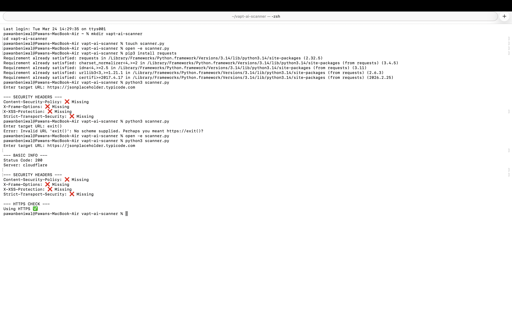
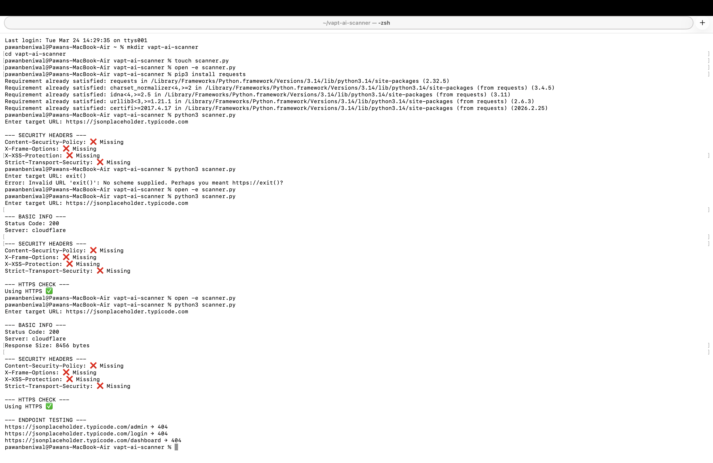
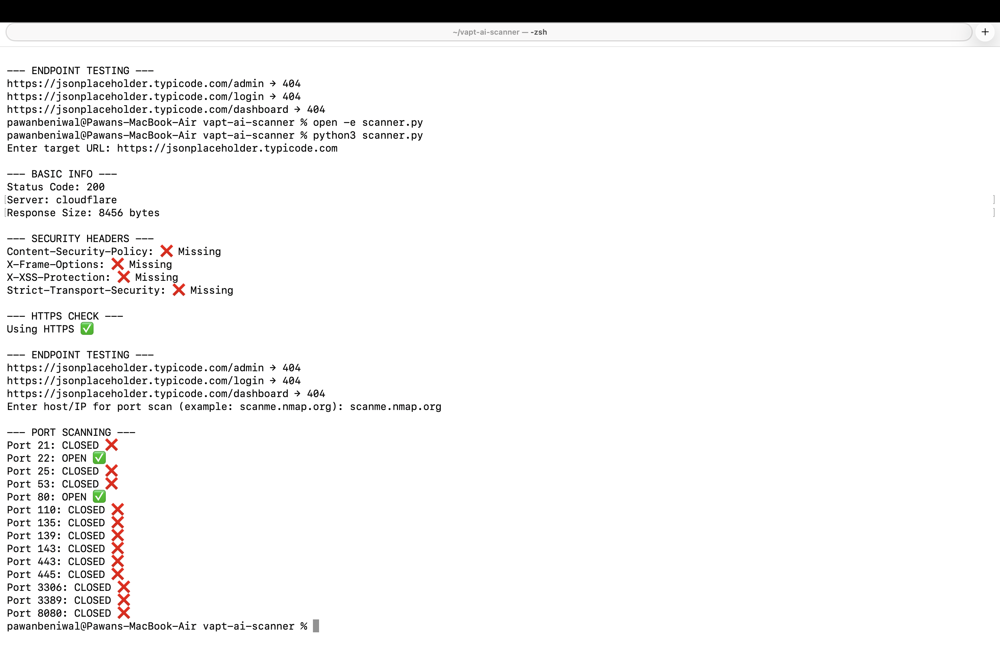
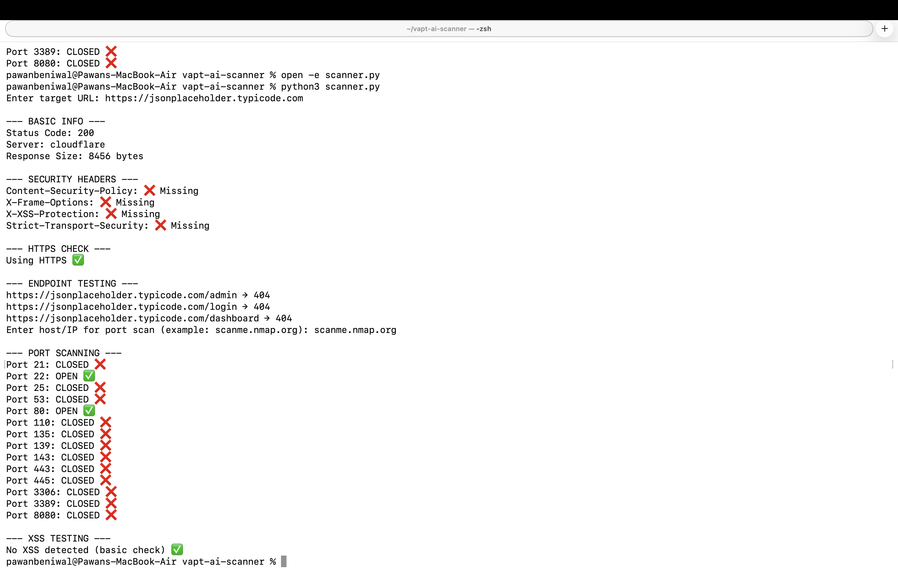
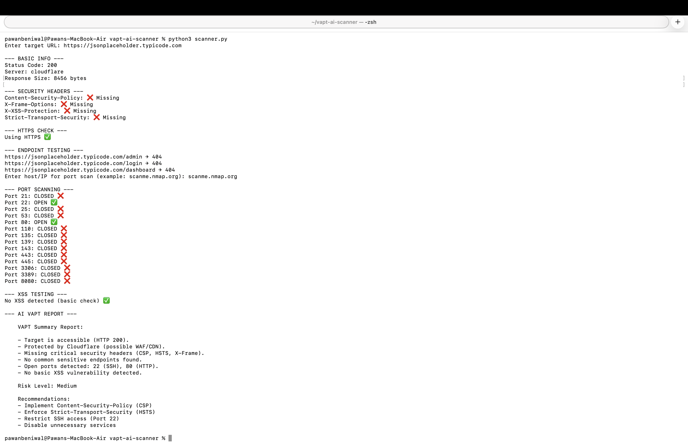

# 🔐 AI-Powered VAPT Scanner

A Python-based Vulnerability Assessment and Penetration Testing (VAPT) tool.

##  Features
- Security Header Analysis
- Endpoint Discovery
- Port Scanning
- Basic XSS Testing
- AI Report Generation

## Screenshots

## Disclaimer
For educational purposes only.